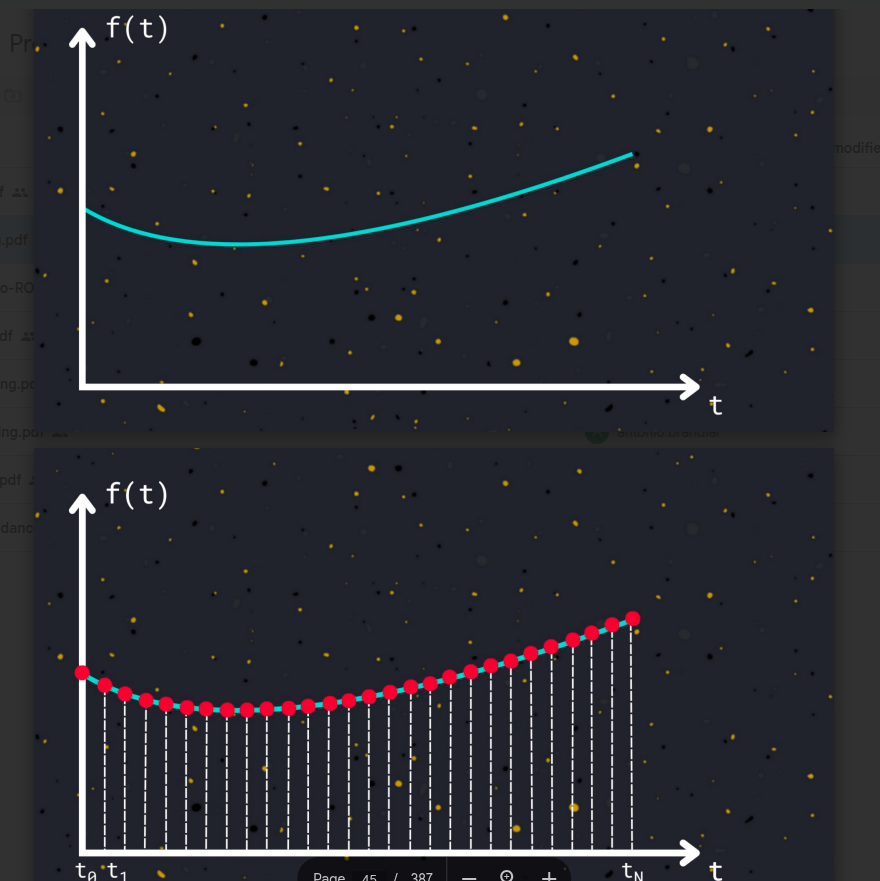
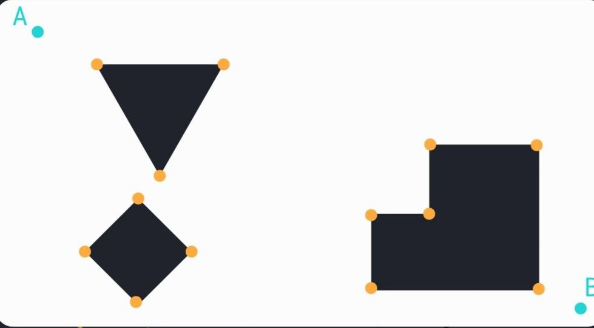

## About the instructor

👋 Hi! I'm **Ahmed Mwafy**

* 🎓Mechatronics Level 200
* ✨Autonomous Member 24-Now
* 🧠 Motion Planning

---

## Session Agenda:

* **What is AVR ..... ?**
* **DIO revision .**
* **The software architecture we're using .**
* **Writing DIO driver together**

---

## Physical Space (Environment)

    

### 🔹 Definition

In path planning, the **environment** refers to the **real physical space** where an autonomous agent—such as a robot or vehicle—navigates. It is the actual world surrounding the agent that must be understood and considered to generate safe and effective paths.

### 🔹 Physical Components

The environment includes:

* **Static objects** : buildings, walls, furniture, roads, etc.
* **Dynamic elements** : people, vehicles, animals, or other moving obstacles
* **Terrain and surface types** : flat ground, slopes, rough terrain, water, etc.
* **Boundaries and limits** : areas the agent is not allowed or able to enter

### 🔹 Summary

The environment in path planning is not a virtual or abstract concept—it's the **real-world physical space** the agent moves through. Understanding and modeling this environment accurately is essential for generating safe, feasible, and goal-directed paths.

---

## Configuration Space (C-space) in Path Planning

    

### 🔹 What is C-space?

The **Configuration Space (C-space)** is an **abstract representation** of all possible positions and orientations (i.e.,  **configurations** ) a robot or agent can have in a given environment.

* Each point in C-space represents a **unique state** (e.g., position and orientation) of the robot.
* It transforms the problem of navigating in a **real physical environment** into a **mathematical space** where planning is easier to compute.

### 🔹 From Physical Space to C-space

While the **environment** is the  **real-world physical space** , the **C-space is a simplified, abstract model** of that space, tailored to the robot's geometry and constraints.

For example:

* In a 2D space, if a circular robot can move freely in an area, its configuration can be represented by (x, y).
* If the robot can also rotate, its configuration becomes (x, y, θ).
* Obstacles in the physical environment become **forbidden regions** in C-space, called  **C-obstacles** .

### 🔹 Components of C-space

1. **Free space (C-free)** :

   All configurations where the robot can exist without colliding with obstacles.

1. **Obstacle space (C-obstacles)** :

   All configurations where the robot would intersect with an obstacle in the environment.

### 🔹 Why Use C-space?

C-space allows planners to:

* Handle **robot geometry and orientation** more precisely.
* Transform complex motion planning problems into  **geometric or graph-based problems** .
* Simplify computation by focusing on configurations rather than full physical simulations.

---

## Discretization in Path Planning

    

### What is Discretization?

**Discretization** is the process of converting a  **continuous space** —like the physical environment or configuration space (C-space)—into a **finite set of discrete elements** that can be processed by algorithms.

* It simplifies complex, infinite possibilities into manageable units.
* Commonly used in grid-based path planning or graph-based search algorithms (e.g., A*, Dijkstra).

### Why Discretize?

Most real-world environments and robot motions are  **continuous** , meaning the robot can be in infinitely many positions and orientations. However:

* Computers cannot process infinite states.
* Discretization makes the problem  **computationally tractable** .

### Where is Discretization Applied?

1. **Physical Environment**
   * Represented as a **grid map** or  **occupancy grid** .
   * Each cell represents a small region of space (e.g., 10 cm × 10 cm).
   * Used to check whether a space is **free** or  **occupied** .
2. **Configuration Space (C-space)**
   * The robot’s possible configurations (e.g., position and angle) are broken into  **discrete steps** .
   * Example: discretizing orientation into 16 fixed angles instead of using all 360°.
3. **Time and Motion**
   * In motion planning, time or movement commands may also be discretized (e.g., move forward in 0.1 m steps).

---

## What is Graph Construction in Path Planning?

In path planning, **graph construction** involves creating a **network of nodes and edges** that represents the **navigable space** of the environment or configuration space (C-space). The resulting graph can be searched using algorithms like A*, Dijkstra, etc., to find the shortest or safest path from start to goal.

There are multiple ways to construct such graphs, one of which is the  **visibility graph** .

---

## 🔹Visibility Graph

A **visibility graph** is a type of graph where:

* **Nodes** represent the  **start point** ,  **goal point** , and  **vertices of obstacles** .
* **Edges** represent direct, unobstructed lines (straight paths) between nodes that are **“visible”** to each other — i.e., no obstacle blocks the line connecting them.

It’s used primarily in **polygonal environments** where obstacles have well-defined shapes (like walls or convex polygons).

## 🔹 How It Works

1. **Input** : A 2D environment with polygonal obstacles, a start point, and a goal point.
2. **Vertices** : Add the  **start** ,  **goal** , and all **polygon corners** as graph nodes.
3. **Edges** : Connect pairs of vertices if the  **straight line between them doesn’t intersect any obstacle** .
4. **Weights** : Edge weights are typically the **Euclidean distance** between connected nodes.

    

    

    

    

---
